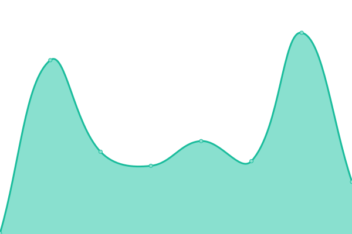
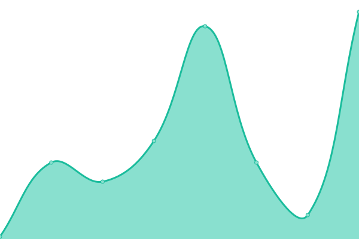
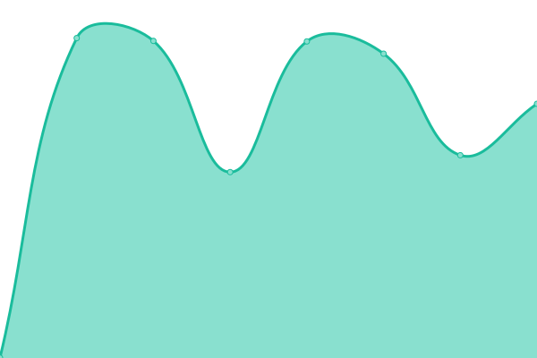

# [📈 Live Status](https://usds.github.io/uptime-monitoring): <!--live status--> **🟩 All systems operational**

This repository contains the open-source uptime monitor and status page for [U.S. Digital Service](https://www.usds.gov), powered by [Upptime](https://github.com/upptime/upptime).

With [Upptime](https://upptime.js.org), you can get your own unlimited and free uptime monitor and status page, powered entirely by a GitHub repository. We use [Issues](https://github.com/usds/uptime-monitoring/issues) as incident reports, [Actions](https://github.com/usds/uptime-monitoring/actions) as uptime monitors, and [Pages](https://usds.github.io/uptime-monitoring) for the status page.

<!--start: status pages-->
<!-- This summary is generated by Upptime (https://github.com/upptime/upptime) -->
<!-- Do not edit this manually, your changes will be overwritten -->
<!-- prettier-ignore -->
| URL | Status | History | Response Time | Uptime |
| --- | ------ | ------- | ------------- | ------ |
|  [USDS Home page](https://www.usds.gov/) | 🟩 Up | [usds-home-page.yml](https://github.com/usds/uptime-monitoring/commits/HEAD/history/usds-home-page.yml) | 

 106ms
     
 | 

<a href="https://usds.github.io/uptime-monitoring/history/usds-home-page">100.00%</a>
    

|  [USDS Apply page](https://www.usds.gov/apply) | 🟩 Up | [usds-apply-page.yml](https://github.com/usds/uptime-monitoring/commits/HEAD/history/usds-apply-page.yml) | 

 55ms
     
 | 

<a href="https://usds.github.io/uptime-monitoring/history/usds-apply-page">100.00%</a>
    

|  [Apply page iframe](https://eop-fra.secure.force.com/digitalservice/) | 🟩 Up | [apply-page-iframe.yml](https://github.com/usds/uptime-monitoring/commits/HEAD/history/apply-page-iframe.yml) | 

 1032ms
     
 | 

<a href="https://usds.github.io/uptime-monitoring/history/apply-page-iframe">100.00%</a>
    

<!--end: status pages-->

[**Visit our status website →**](https://usds.github.io/uptime-monitoring)

## 📄 License

- Powered by: [Upptime](https://github.com/upptime/upptime)
- Code: [MIT](./LICENSE) © [U.S. Digital Service](https://www.usds.gov)
- Data in the `./history` directory: [Open Database License](https://opendatacommons.org/licenses/odbl/1-0/)
